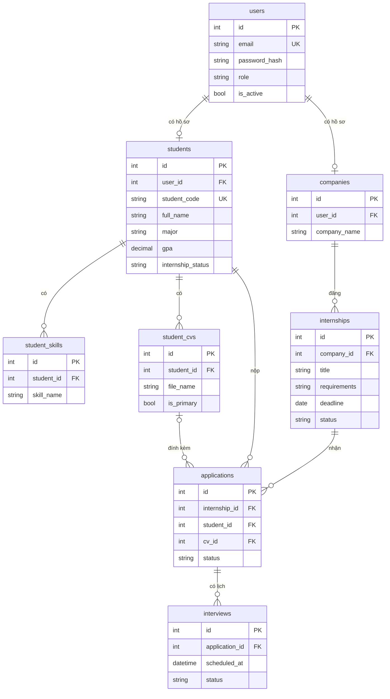

# Sơ đồ quan hệ thực thể (ERD)

Mở file này trên GitHub hoặc VS Code có tiện ích Mermaid để xem hình. Có thể dán đoạn mã vào https://mermaid.live rồi xuất ảnh để đưa vào báo cáo.

```mermaid
erDiagram
    users ||--o| students : "có hồ sơ"
    users ||--o| companies : "có hồ sơ"
    students ||--o{ student_skills : "có"
    students ||--o{ student_cvs : "có"
    companies ||--o{ internships : "đăng"
    internships ||--o{ applications : "nhận"
    students ||--o{ applications : "nộp"
    student_cvs |o--o{ applications : "đính kèm"
    applications ||--o{ interviews : "có lịch"

    users { int id PK
            string email UK
            string password_hash
            string role
            bool is_active }
    students { int id PK
               int user_id FK
               string student_code UK
               string full_name
               string major
               decimal gpa
               string internship_status }
    student_skills { int id PK
                     int student_id FK
                     string skill_name }
    student_cvs { int id PK
                  int student_id FK
                  string file_name
                  bool is_primary }
    companies { int id PK
                int user_id FK
                string company_name }
    internships { int id PK
                  int company_id FK
                  string title
                  string requirements
                  date deadline
                  string status }
    applications { int id PK
                   int internship_id FK
                   int student_id FK
                   int cv_id FK
                   string status }
    interviews { int id PK
                 int application_id FK
                 datetime scheduled_at
                 string status }
```
